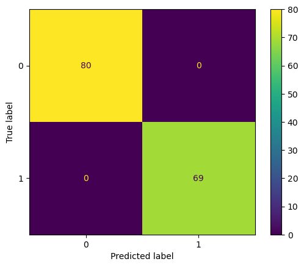
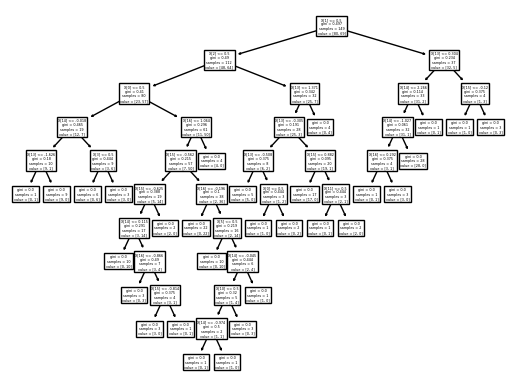
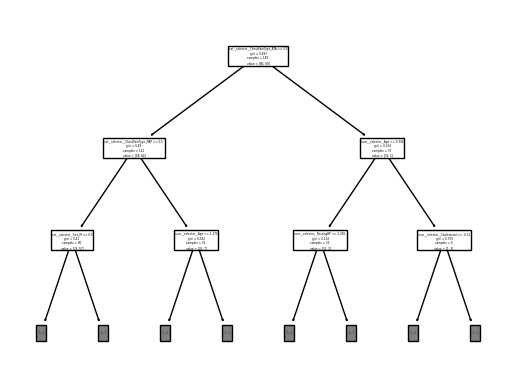
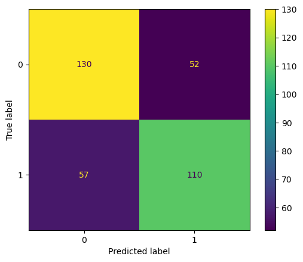

# Heart Disease Prediction Using Machine Learning

This project uses multiple supervised learning models to predict the presence of heart disease based on clinical attributes. The dataset is sourced from online and includes key health indicators such as cholesterol, blood pressure, age, and exercise-induced angina.

---

## Dataset

- **File**: `heartdisease.csv`
- **Target**: `target` (1 = heart disease present, 0 = not present)
- **Features**: `age`, `sex`, `cp` (chest pain type), `trestbps`, `chol`, `thalach`, `exang`, etc.

---

## Models Used

The notebook tests and compares the performance of four machine learning classifiers:

| Model                     | Description                            |
|--------------------------|----------------------------------------|
| **Logistic Regression**  | Baseline classification model          |
| **K-Nearest Neighbors**  | Simple, instance-based learner (K=7)   |
| **Decision Tree**        | Tree-based split on feature thresholds |
| **Random Forest**        | Ensemble model of multiple decision trees |

---

## Workflow Summary

1. **Data Loading & Cleaning**
2. **Exploratory Data Analysis**
3. **One-Hot Encoding** of categorical features
4. **Standardization** of numerical features
5. **Train-Test Split**
6. **Model Training** (LogReg, KNN, Tree, RF)
7. **Evaluation** using accuracy and classification reports

---

## Sample Output

```text
Logistic Regression Accuracy: 0.85
KNN Accuracy: 0.79
Decision Tree Accuracy: 0.78
Random Forest Accuracy: 0.86
```

---

## How to Run

1. Clone the repository:
   ```bash
   git clone https://github.com/TEDDYZ11/heart-disease-prediction.git
   cd heart-disease-prediction
   ```

2. Install dependencies:
   ```bash
   pip install -r requirements.txt
   ```

3. Open the notebook:
   ```bash
   jupyter notebook Heart-Health-ML_project.ipynb.ipynb
   ```

---

## Technologies

- Python
- pandas, numpy
- scikit-learn
- seaborn, matplotlib
- Jupyter Notebook

---

## Project Conclusion

Among all models tested, the Random Forest Classifier achieved the highest accuracy, making it the most effective at predicting heart disease in this dataset.  
Logistic Regression also performed well with high interpretability, while KNN and Decision Tree showed slightly lower predictive performance.  
The results demonstrate that ensemble models like Random Forest can provide strong predictive power for health-related classification tasks.

---

### Model Visualization and Performance

Below are examples of decision tree structures and confusion matrices generated during model evaluation.

#### Confusion Matrix - High Accuracy


#### Decision Tree (Complex)


#### Decision Tree (Simplified)


#### Confusion Matrix - Balanced Accuracy


---

#### Conclusion

Through this project, I successfully built and compared multiple machine learning models to predict the presence of heart disease using a real-world dataset. Among the models tested, the Decision Tree Classifier demonstrated excellent performance with high precision and recall, as reflected in the confusion matrix. Visualizations of tree structures provided interpretability, aiding in understanding how specific features influenced predictions.

Overall, this analysis not only showcases the power of supervised learning in healthcare data but also highlights the importance of model selection and evaluation. Future improvements may include hyperparameter tuning, using ensemble methods like XGBoost, and deploying the model for real-time health screening.

---

## Author
**Zhihong Zhang**  
